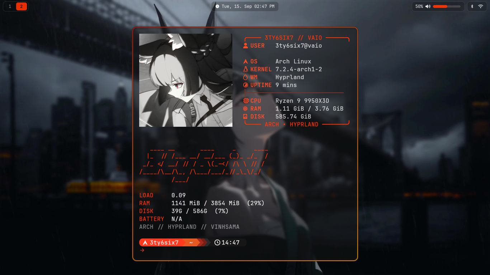
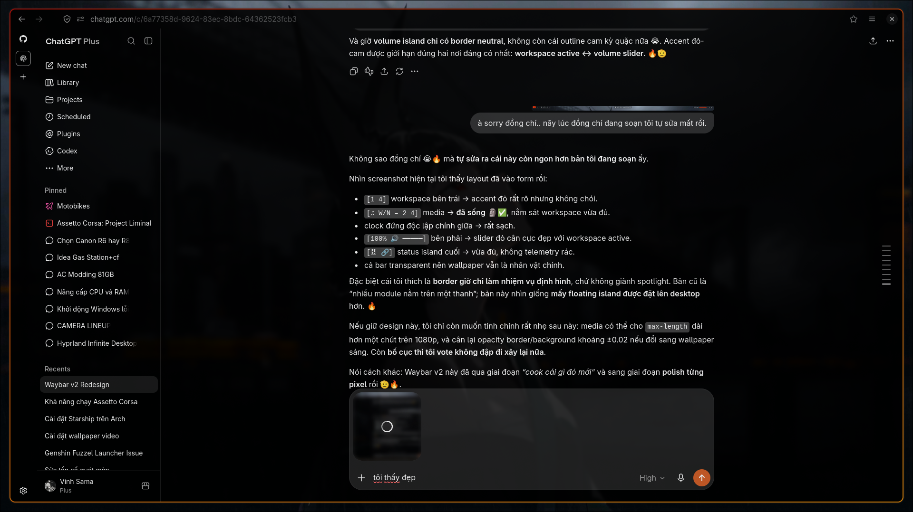

# 3667-space

Personal Arch Linux desktop configuration for a Hyprland-based Wayland setup.



## What is included

- **Hyprland** — layout, animation, keybinding, lock-screen, wallpaper, and startup configuration.
- **Waybar** — a transparent, island-style status bar with workspaces, media, clock, audio, battery, Bluetooth, and network controls.
- **Desktop tools** — configuration for Kitty, Fuzzel, Dunst, Fastfetch, Btop, Cava, Yazi, Starship, Fcitx5, Dolphin, Thunar, and OpenRGB.
- **Utilities** — local commands for screenshots, microphone gain, Waybar toggling, and game launchers.
- **System inventory** — installed Arch and AUR package lists plus enabled user services.
- **Assets** — wallpapers, GIFs, and screenshots used by the desktop.

## Preview

| Desktop | Lock screen |
| --- | --- |
|  |  |

## Requirements

This setup targets **Arch Linux**, **Hyprland**, and a Wayland session. The package manifests are the canonical reference for the original machine:

- [`packages/pacman-explicit.txt`](packages/pacman-explicit.txt) — explicitly installed packages.
- [`packages/aur.txt`](packages/aur.txt) — AUR packages.
- [`packages/user-services-enabled.txt`](packages/user-services-enabled.txt) — enabled per-user services.

Core desktop components include Hyprland, Hyprlock, Hyprpaper, Waybar, Kitty, Fuzzel, Dunst, PipeWire/WirePlumber, NetworkManager, and a Nerd Font.

## Installation

Clone the repository and install the packages you want before copying or linking configuration files into place:

```sh
git clone https://github.com/3ty6six7/3667-space.git
cd 3667-space
```

Most top-level configuration directories belong under `~/.config`. For example:

```sh
mkdir -p ~/.config
ln -sfn "$PWD/hypr" ~/.config/hypr
ln -sfn "$PWD/waybar" ~/.config/waybar
ln -sfn "$PWD/kitty" ~/.config/kitty
ln -sfn "$PWD/dunst" ~/.config/dunst
ln -sfn "$PWD/fuzzel" ~/.config/fuzzel
ln -sfn "$PWD/fastfetch" ~/.config/fastfetch
ln -sfn "$PWD/yazi" ~/.config/yazi
ln -sfn "$PWD/cava" ~/.config/cava
```

Link individual top-level files where their applications expect them:

```sh
ln -sfn "$PWD/starship.toml" ~/.config/starship.toml
ln -sfn "$PWD/.zshrc" ~/.zshrc
ln -sfn "$PWD/.bashrc" ~/.bashrc
```

The scripts in `local-bin/bin` are intended for `~/.local/bin`. Make them available on your `PATH`:

```sh
mkdir -p ~/.local/bin
ln -sfn "$PWD/local-bin/bin"/* ~/.local/bin/
```

## Customization before use

This is a snapshot of one machine, not a universal installer. Review these items before enabling it:

- Update the monitor in [`hypr/hyprland.lua`](hypr/hyprland.lua) and [`hypr/hyprpaper.conf`](hypr/hyprpaper.conf).
- Replace `/home/3ty6six7` paths in the Hyprland and wallpaper configuration with your own home directory.
- Choose a wallpaper from `Pictures/Wallpapers/`, then update `hyprpaper.conf`.
- Check application commands in `waybar/config.jsonc` and Hyprland keybindings; some refer to locally installed applications.
- Review the package lists instead of installing them blindly—they reflect the original system, including gaming and hardware-specific packages.

## Key bindings

The main modifier is `SUPER`.

| Binding | Action |
| --- | --- |
| `SUPER` + `X` | Open Kitty |
| `SUPER` + `SPACE` | Open Fuzzel |
| `SUPER` + `E` | Open Yazi in Kitty |
| `SUPER` + `F` | Open Firefox |
| `SUPER` + `L` | Lock the session |
| `SUPER` + `W` | Toggle Waybar |
| `SUPER` + `A` | Open the system-information panel |
| `SUPER` + `SHIFT` + `E` | Open Dolphin |

See [`hypr/hyprland.lua`](hypr/hyprland.lua) for the complete binding set and window-management rules.

## Notes

Configuration in this repository may change the appearance and behavior of your desktop substantially. Back up any existing dotfiles before linking these files, and treat package lists and hardware-specific settings as references to adapt.
